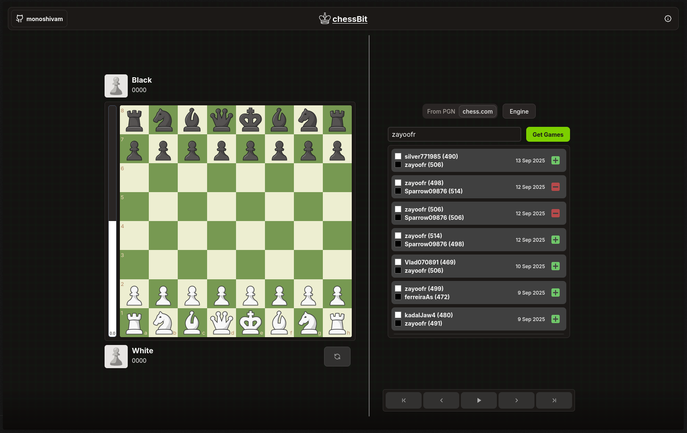
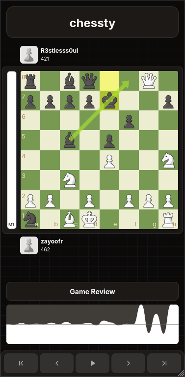

# [chessBit](https://chessbit.vercel.app/)

|  |  |
|:--------------------------------------:|:-------------------------------------:|

chessBit is a powerful, modern, sleek, and intuitive chess analysis platform built for players who want to grow smarter with every move.

## Tech Stack 💻

**chessBit is built using the following technologies:**

- **Next.js 15:** chessBit is built using the Next.js framework, which provides a seamless and efficient development experience for creating modern web applications.

- **Tailwind CSS:** The user interface of chessBit is designed using Tailwind CSS, a highly customizable CSS framework that enables rapid and responsive UI development.

- **TypeScript:** chessBit is developed using TypeScript, a statically typed superset of JavaScript that enhances code quality, maintainability, and developer productivity.

- **React:** The user interface components of chessBit are built using React, a popular JavaScript library for building interactive and reusable UI components.

### Click [here](https://chessbit.vercel.app/) to visit the live demo website.

